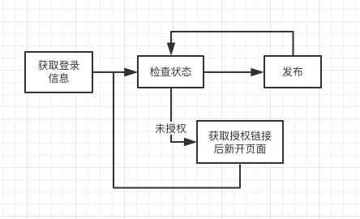

# 航加小程序SDK

## 安装

`composer require hangjia/xcx`

## API文档
> API使用流程图



### 登录
```php
$user = \HangJia\Xcx\Factory::user();
$re = $user->login();
// 输出
Array {
    'code' => 200,
    'msg' => '',
    'data' => Array {
        'user_name' => 'xxx', // 用户名
        'partner_id' => 1, // 合作商ID
        'app_id' => 13     // 应用ID
    }
}
```

### 获取授权地址
> 该接口返回一个链接地址，请新开一个窗口跳转，授权结束后会页面会自动关闭。
```php
// $note（可选） 备注
$auth = \HangJia\Xcx\Factory::auth();
$url = $auth->getAuthUrl($app_id, $partner_id, $note = null);
// 获取地址后重定向到该地址
```
### 发布
[小程序第三方开发文档](https://developers.weixin.qq.com/miniprogram/dev/devtools/ext.html)
```php
// $ext_json array 第三方小程序配置文件 详情见上方文档
$submit = \HangJia\Xcx\Factory::submit();
$re = $submit->release($app_id, $ext_json);
// 只返回队列号，异步接口，所以查看状态请使用 "发布状态" 接口。
```

### 发布状态
```
状态码字典:

需要弹出授权页面的状态(大于10000)

10001: 未授权

10002：取消授权

10003: 已授权但缺少部分权限（如开发权限）

授权后的状态

-1: 授权后，但是未提交过版本

0: 接受请求，但还没有提交到微信端。

1: 代码审核中

2: 审核通过

3: 审核失败, 检查reason字段获取详细报错信息

4: 已上线

5: 出现错误，检查reason字段获取详细报错信息

6: 撤销审核
```
```php
$submit = \HangJia\Xcx\Factory::submit();
$re = $submit->status($app_id);
// 输出
Array {
    code => 200,
    'msg' => '',
    'data' => Array {
        'status' => 1,
        'version' => '小程序版本号',
        'desc' => '小程序版本备注',
        'reason' => '错误描述', // status 为3，5时候出现
        'platform' => Array { // 本数组显示线上的版本号，上面的数组显示的是你当前提交的版本信息
            'version' => '版本号',
            'desc' => '版本描述'
        }
    }
}
```

## 平台接口

### 获取component access token
```php
// secret_key（密钥）和partner_id（合作商ID）可在合作商后台-基本信息中找到
$platform = \HangJia\Xcx\Factory::platform([
    'secret_key' => 'xxxxxxxxxxxxx'
]);
$ret = $platform->getToken($partner_id);
// 输出
Array {
    "code": 200,
    "msg": "success",
    "data": Array {
        "component_access_token": "1iovFkaJK.....................",
        "expires_date": "2018-10-15 15:49:48" // 过期时间
    }
}
```
